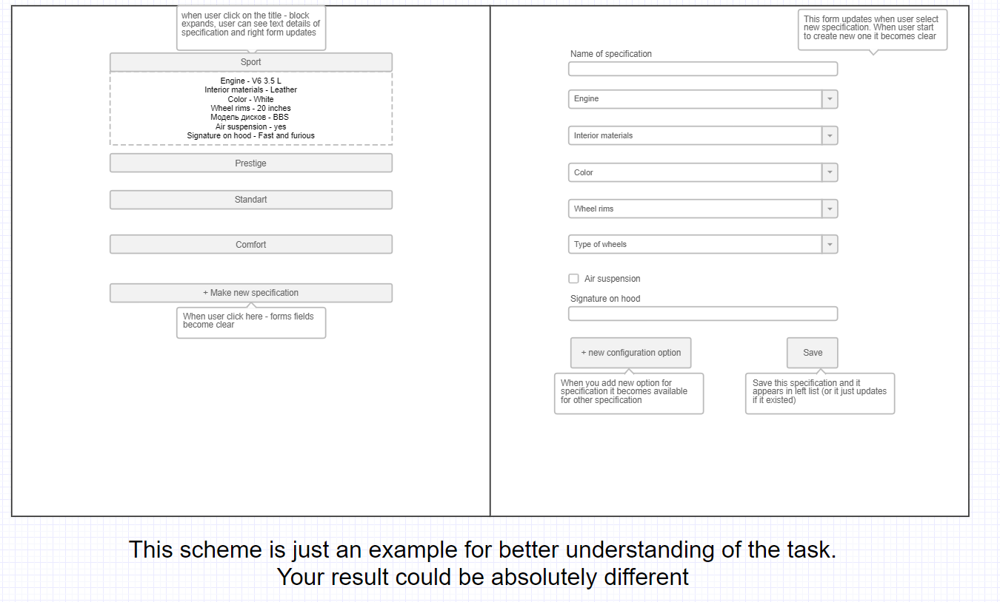

# Car Specification from TextMagic

## Description

Within this task, please implement a configurator for car specifications.

Stories:

1. There should be some prebuilt specifications

2. Add functionality to create new individual specifications with the opportunity to choose: wheel rims size, interior materials, engine, car color with the type of paint, etc.

3. We assume that there could be any other config parameters.

Example of the specification:

```
Brand - N model Т
Engine - v6, petrol
Air suspension - no

Exterior:
Body color - white
Type of paint - gloss
Wheel size - 15 inches

Interior:
Seats - leather
```

Code requirements: Typescript, OOP, any UI framework. The application should be scalable.

UI requirements: minimal interactivity, UI has the smallest priority.

## Prerequisites

- MongoDB v5

## How to setup

1. `npm i` to install dependencies
2. Configure .env file to set database connection string
3. `npm run migrate` to init database
4. `npm run seed` to seed the inital records
5. `npm start` to start the project
